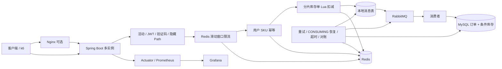

# MiniSeckill

[](https://github.com/leinay633-maker/mini-seckill/actions/workflows/ci.yml)


[](LICENSE)

MiniSeckill 是一个聚焦秒杀下单核心链路的 Java 后端面试项目。它不追求完整商城功能，而是用可运行代码、自动化测试和真实压测证据回答几个关键问题：高并发下如何防超卖、防重复、削峰、保证消息可恢复，以及如何让优化结论可复现。

## 核心能力

- Redis ZSET 滑动窗口限流，保留固定窗口作为回退选项。
- token、隐藏下单 path、可选 JWT 和验证码组成入口防刷骨架。
- Redis 用户 SKU 幂等 + MySQL 联合唯一索引双重防重复。
- Redis 分片库存由单次 Lua 原子遍历扣减；Redis Cluster profile 显式关闭单 Lua并回退兼容路径。
- RabbitMQ 异步削峰，本地消息表记录投递状态，confirm/return、重试、死信和 `CONSUMING` 租约恢复组成消息闭环。
- MySQL 条件更新 `available_stock > 0` 和分段库存兜底，数据库层不依赖无效的 `version` 字段。
- 41+10+12 位雪花订单 ID，多实例通过 `MINI_SECKILL_WORKER_ID` 分配 workerId。
- 高频秒杀日志使用有界线程池异步写入，可通过配置一键切回同步模式。
- Redis 恢复态、库存对账、排队超时和补偿记录覆盖异常链路。
- GitHub Actions 执行单元测试、Testcontainers 集成测试、JaCoCo 门槛、Compose 校验和压测证据检查。

## 架构



主链路返回“排队中”只代表准入和消息链路已受理，最终状态以订单查询结果为准。

## 技术栈

- Java 17、Spring Boot 3.3.5、Maven
- MyBatis、MySQL 8
- Redis、Redisson、Redis Lua
- RabbitMQ
- Caffeine、Micrometer、Prometheus、Grafana
- Springdoc OpenAPI
- JUnit 5、Mockito、MockMvc、Luaj、Testcontainers、JaCoCo
- Docker Compose、Nginx、k6

## 快速启动

### 1. 启动基础组件

```bash
docker compose up -d
```

默认连接信息：

| 组件 | 地址 / 账号 |
|---|---|
| MySQL | `localhost:3306`，`miniseckill / miniseckill` |
| Redis | `localhost:6379` |
| RabbitMQ | `localhost:5672`，`guest / guest` |
| RabbitMQ Management | `http://localhost:15672` |

### 2. 启动应用

本机有 JDK 17 和 Maven 时：

```bash
mvn spring-boot:run
```

也可以直接构建容器化多实例：

```bash
docker compose \
  -f docker-compose.yml \
  -f docker-compose.app-scale.yml \
  up -d --build
```

Nginx 叠加配置会把代理固定在独立网络的 `172.29.0.10`，并只让应用信任这个直连代理的转发头；直接访问 `8080` 到 `8083` 时，伪造的 `X-Forwarded-For` 仍会被忽略。若调整 edge 子网或代理地址，必须同步更新 `SECKILL_SECURITY_TRUSTED_PROXIES`。

四个实例分别监听 `8080` 到 `8083`，workerId 为 `0` 到 `3`。多实例部署必须保证 workerId 不重复。

叠加 Nginx 和监控：

```bash
docker compose \
  -f docker-compose.yml \
  -f docker-compose.app-scale.yml \
  -f docker-compose.nginx.yml \
  -f docker-compose.monitoring.yml \
  up -d --build
```

本机可靠性演练使用资源限制 overlay，并把 Nginx 边缘限流与应用压测隔离开：

```bash
docker build -t mini-seckill:local .
docker compose \
  -f docker-compose.yml \
  -f docker-compose.app-scale.yml \
  -f docker-compose.nginx.yml \
  -f docker-compose.monitoring.yml \
  -f docker-compose.bench-limits.yml \
  up -d
```

`nginx-bench.conf` 只用于隔离应用正确性压测，不能替代生产限流值。

### 3. 打开接口文档

- Swagger UI：`http://localhost:8080/swagger-ui.html`
- OpenAPI JSON：`http://localhost:8080/v3/api-docs`
- 健康检查：`http://localhost:8080/actuator/health`
- Prometheus 指标：`http://localhost:8080/actuator/prometheus`

## 核心接口

### 初始化和预热

```bash
curl -X POST "http://localhost:8080/api/seckill/init?activityId=1&skuId=1001&stock=100"
curl -X POST "http://localhost:8080/api/seckill/warmup?activityId=1&skuId=1001"
```

### 获取 token 与隐藏 path

```bash
curl "http://localhost:8080/api/seckill/token?activityId=1&userId=10001&skuId=1001"
```

### 下单

推荐使用 token 返回的 `orderPath`：

```bash
curl -X POST "http://localhost:8080/api/seckill/order/<orderPath>" \
  -H "Content-Type: application/json" \
  -d '{"activityId":1,"userId":10001,"skuId":1001,"token":"<token>"}'
```

兼容入口 `/api/seckill/order` 仍保留，方便旧压测脚本和本地演示。

### 查询最终状态

```bash
curl "http://localhost:8080/api/order/query?activityId=1&userId=10001&skuId=1001"
curl "http://localhost:8080/api/seckill/stock?activityId=1&skuId=1001"
```

HTTP 状态码与 body `code` 同时表达语义：参数错误、鉴权失败、重复下单和限流分别映射为 400、403、409、429；部分兼容业务拒绝仍可能返回 HTTP 200 + 业务 code。`SeckillControllerTest` 对两层语义做了 MockMvc 覆盖。

## 关键配置

| 配置 | 默认值 | 说明 |
|---|---:|---|
| `seckill.snowflake.worker-id` | `0` | 多实例必须唯一，可用 `MINI_SECKILL_WORKER_ID` 覆盖 |
| `seckill.async-log.enabled` | `true` | 高频日志异步写；关闭后同步写 |
| `seckill.rate-limit.enabled` | `true` | 业务限流总开关 |
| `seckill.rate-limit.algorithm` | `SLIDING_WINDOW` | 默认 ZSET 滑动窗口，可切 `FIXED_WINDOW` |
| `seckill.anti-brush.enabled` | `true` | token、隐藏 path 等入口防刷 |
| `seckill.stock-shard.enabled` | `true` | Redis 分片库存 |
| `seckill.stock-shard.single-lua-enabled` | `true` | 单机 Redis 用一次 Lua 遍历分片；Cluster 配置关闭 |
| `seckill.dynamic-rate-limit.cache-ttl` | `5s` | 动态规则及“无规则”负缓存 TTL |
| `seckill.order-timeout.queued-timeout` | `10m` | 排队超时后关闭并释放用户 SKU 幂等 key |
| `seckill.mq-consumer.auto-startup` | `true` | 演练时可关闭消费者制造可控积压，默认正常消费 |
| `seckill.security.trust-forwarded-header` | `false` | 默认不信任 X-Forwarded-For |
| `seckill.security.trusted-proxies` | 本地私网前缀 | 仅在开启转发头后使用；生产应配置精确代理 IP（当前也支持以点结尾的简化前缀，标准 CIDR 待实现） |

配置类中的默认值是最终兜底；`application.yml` 可以只覆盖需要显式展示的项。

## 正确性设计

### 防超卖

1. Redis Lua 原子扣减入口库存。
2. MySQL 事务内执行条件更新，只有 `available_stock > 0` 才成功。
3. MySQL 分段库存降低热点行竞争。
4. 集成测试使用真实 Redis 并发扣减，断言成功数等于库存且余量为 0。

`sku_stock.version` 已删除：旧字段只自增，从未出现在 `WHERE version = ?` 中，不构成乐观锁。条件更新本身就是数据库层的原子 compare-and-set。

### 防重复

1. token 热路径先查 Redis 订单状态和用户 SKU 幂等 key，再回源 MySQL。
2. 下单时使用 Redis `SET NX` 挡重复点击。
3. MySQL 联合唯一索引作为最终兜底。
4. 排队超时后删除幂等 key，避免用户在 10 到 30 分钟窗口内永久无法重试。

### 可靠消息

- 本地消息状态包含 PENDING、SENDING、SENT、CONSUMING、CONSUMED、FAILED、TIMEOUT、DEAD 等状态。
- confirm ack 只允许 SENDING → SENT，消费者先抢占 CONSUMING 再执行事务。
- 瞬时数据访问异常回到可重试状态；确定性库存失败记录 FAILED 订单，保证结果长期可查。
- 定时任务恢复长时间停留在 CONSUMING 的租约，并处理重投、超时、对账和死信回放。

## 测试与 CI

单元测试和 JaCoCo：

```bash
mvn -B clean verify
```

真实 Redis/MySQL Testcontainers 集成测试：

```bash
mvn -B clean -Pintegration-test verify
./scripts/assert-integration-tests-ran.sh
```

证据与工程文件检查：

```bash
./scripts/check-evidence.sh
```

CI 还会逐层解析基础依赖、多实例、Nginx、监控和资源限制 overlay，避免提交无法组合的 Compose 配置。

## 压测结果

2026-07-13 在 Apple M1、k6 v2.1.0、Docker 29.5.3 环境完成同机同参对比，每个主场景三轮取逐指标中位数：

| 场景 | 关键结果 |
|---|---|
| 不同用户 75/s × 60s | 成功入队 p95：8.17 ms → 5.49 ms，下降 32.8% |
| 重复请求 75/s × 60s | 成功入队 p95：7.92 ms → 4.76 ms，下降 39.9% |
| 售罄尾部 300/s × 30s | 整体 HTTP p99：98.27 ms → 12.04 ms，下降 87.7% |
| 限流 + anti-brush 全开 | 动态规则查询 1999 → 7；用户订单事实查询 4501 → 1000 |
| 异步日志同 jar 对照 | 成功入队 p95：14.47 ms → 5.49 ms，下降 62.1% |

所有优化百分比只比较同一台 Mac 上的基线与优化版。旧 Windows 数据真实保留，但不参与跨机计算。

2026-07-21 又补了四条可靠性证据：四实例三场景 `order_id` 零重复；Redis 停止 180 秒后按 MySQL 事实恢复并继续放量；1000 条 MQ 积压 9 秒追平；45 分钟 soak 持续采集 JVM/连接池/消息表数据。它们只验证本机正确性与恢复语义，不外推生产容量；backlog 与 soak 必须先停止 app-scale 实例，避免其它消费者抢走演练消息，具体顺序见可靠性报告。

- 优化前后性能报告：[REPORT.md](REPORT.md)
- 多实例、故障、积压、soak 与告警报告：[REPORT-RELIABILITY.md](REPORT-RELIABILITY.md)
- 阶段 0 冻结基线：[benchmark/BASELINE.md](benchmark/BASELINE.md)
- 精选原始证据：[benchmark/evidence/mac-arm64/README.md](benchmark/evidence/mac-arm64/README.md)

## 项目边界

这是面向学习和面试展示的单机/多实例样板，不是生产级电商系统。项目没有实现支付、商品中心、生产风控、跨地域容灾和容量自动扩缩；压测也不用于外推生产集群容量。文档会明确区分“已经由代码或证据验证”与“生产环境仍需补齐”的部分。

## License

[MIT](LICENSE)
